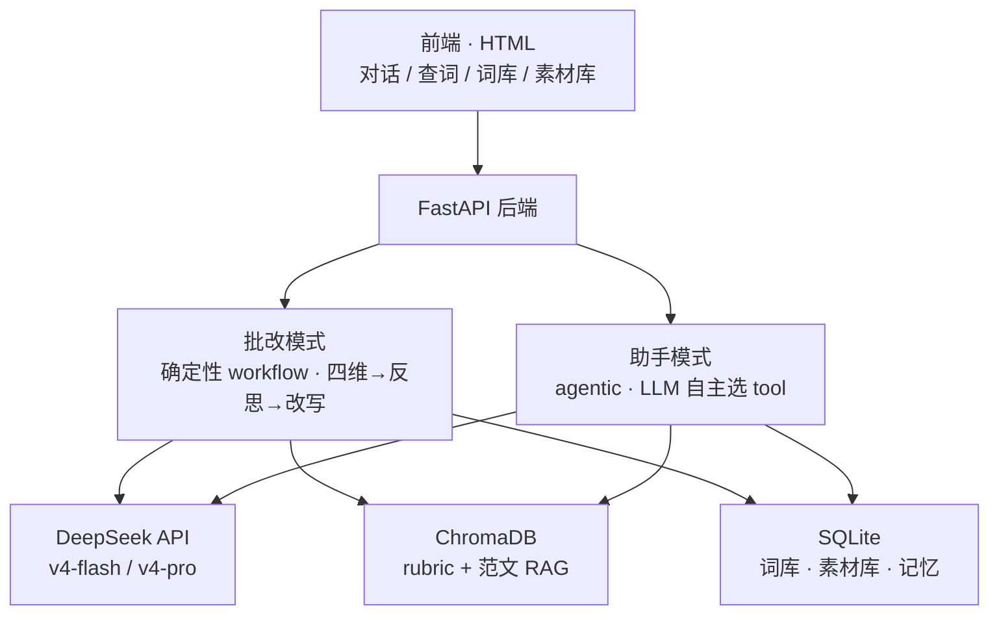

# IELTS Writing Agent — 项目设计文档

> 一个面向雅思写作（Task 1 + Task 2）的智能批改与学习 Agent。
> 核心定位：**可落地、有真实价值**的全栈 AI Agent 项目。
> 技术主线：LangGraph 编排 + DeepSeek API + 本地 embedding + RAG + 跨会话记忆 + 量化评测。

---

## 1. 项目概述（Why）

### 1.1 要解决的问题

雅思写作备考的核心痛点是**反馈稀缺**：考生写完一篇作文，很难得到按官方评分维度拆解的、可执行的、个性化的反馈。市面上的工具大多是"打个总分 + 一段套话"，既不透明也不可信。

本项目做一个能力更接近真人写作教练的 Agent：

- 按官方四维评分标准（TA / CC / LR / GRA）拆解评估，每个维度给分 + 给依据；
- 用真实已知分数的范文做锚定，让打分**可校准、可量化验证**；
- 提供词汇升级、范文思路、语法检查等工具，且支持沉淀到用户私有的**词库 / 素材库**；
- 跨会话记住学生反复犯的错，反馈逐步个性化。

### 1.2 技术定位与差异化

本项目刻意规避两种常见形态——"什么都做但都浅"和"又一个 RAG 套壳 chatbot"：scope 窄（只做写作），但在三个硬技术点上求深度——**结构感知的 RAG、跨会话记忆、量化评测（evaluation）**。其中 evaluation 是核心差异化资产：在考官标注的测试集上量化验证打分质量（overall band 的 ±0.5 一致率 / QWK），而非自说自话。

### 1.3 官方评分四维（贯穿全项目的领域核心）

| 维度           | 英文                                | 评估内容                                                          |
| -------------- | ----------------------------------- | ----------------------------------------------------------------- |
| 任务完成       | Task Achievement / Response (TA/TR) | 是否完整回应题目要求（Task 1 数据描述准确性 / Task 2 论点完整性） |
| 连贯衔接       | Coherence & Cohesion (CC)           | 逻辑组织、段落划分、衔接手段                                      |
| 词汇资源       | Lexical Resource (LR)               | 词汇丰富度、准确性、搭配、地道程度                                |
| 语法多样与准确 | Grammatical Range & Accuracy (GRA)  | 句式多样性、语法准确率                                            |

---

## 2. 范围（Scope）

### 2.1 In Scope

- 雅思写作 **Task 1（学术类图表描述）** 与 **Task 2（议论文）**。
- 两种交互模式：**批改模式**（提交作文走确定性评估流水线）与 **助手模式**（对话式、按需调用工具）。
- 工具集：词汇升级、范文生成（含思路）、语法检查、查词、一键归档。
- 私有数据：词库、素材库、学生画像（长期记忆）。
- 量化评测体系。
- 简洁的 Web 前端。

### 2.2 Out of Scope（明确不做）

- 口语 / 听力 / 阅读（保持 scope 收窄，深度优先）。
- 多智能体（multi-agent）架构——对单一职责的写作教练是错误抽象，徒增延迟与成本。
- 移动端原生 App、用户系统与鉴权（demo 阶段单用户或简单 user_id 即可）。
- 自训练 / 微调模型（用 DeepSeek API + 提示工程）。

---

## 3. 系统架构

### 3.1 两模式设计（核心思想）

整个系统的关键设计是把交互分成两类，它们**共用底层的模型与存储**：

- **批改模式（确定性 workflow）**：四个评分维度必须每次都跑，绝不让 LLM "自己决定要不要查语法"。这是一个 workflow，不是自主 agent。
- **助手模式（agentic）**：学生在对话里追问"升级这段词汇""delineate 什么意思""给我一篇范文"，此时 LLM 通过 function calling 自主选择工具。这才是真正的 agent 行为。



### 3.2 技术栈一览

| 层         | 选型                      | 说明                                                                                    |
| ---------- | ------------------------- | --------------------------------------------------------------------------------------- |
| 编排框架   | **LangGraph**             | StateGraph + 子图 + 条件边 + checkpointer                                               |
| LLM        | **DeepSeek API**          | `deepseek-v4-flash`（快/省，1M 上下文）/ `deepseek-v4-pro`（推理/agentic）；OpenAI 兼容 |
| Embedding  | **本地 bge-m3**（Ollama） | DeepSeek 不提供 embedding，单独解决；本地零成本、中英双语强                             |
| 向量库     | **ChromaDB**              | rubric 与范文两个集合，带 metadata 过滤                                                 |
| 结构化存储 | **SQLite**                | 作文语料、词库、素材库、学生画像、批改历史                                              |
| 后端       | **FastAPI**               | 包住 LangGraph，SSE 流式                                                                |
| 前端       | **纯 HTML/CSS/JS**        | 薄客户端，四视图 + tab 切换                                                             |
| 可观测性   | 日志 / trace + 成本统计   | 阶段 6 接入                                                                             |

> **DeepSeek 接入注意**：base_url 设为 `https://api.deepseek.com`，用 `langchain-openai` 的 `ChatOpenAI` 即可。旧模型名 `deepseek-chat` / `deepseek-reasoner` 将于 2026-07-24 停用，新项目直接用 `v4-flash` / `v4-pro`。thinking 模式通过 `reasoning_effort` + `extra_body={"thinking": {"type": "enabled"}}` 开启，且 thinking 模式下 `temperature` 等采样参数不生效。

---

## 4. 核心技术设计

### 4.1 Agent 框架：LangGraph + 组合式改造

选 LangGraph 当编排主干，原因是本项目核心是一个 **评估 → 反思 → 修订** 的可回环流程，LangGraph 的 `StateGraph` + 条件边让这个 loop 显式、可控、可调试，`checkpointer` 天然支持多轮与断点续跑。

**"改造框架以适配项目"通过组合（composition）实现，而非 fork 源码。** 定制发生在五个地方：

1. **自定义 State schema**（`TypedDict`）——承载写作教练的全部工作状态。
2. **子图拆分**——每个评分维度做成一个 subgraph（检索对应 band rubric → 打分 → 给依据）。
3. **自定义条件边路由函数**——reflection 回环、成本感知路由都在此。
4. **自定义 reducer**——并行四维打分后的聚合逻辑。
5. **memory 读/写做成显式 node**——而非塞进对话历史。

#### State schema（示意）

```python
from typing import TypedDict, Annotated
import operator

class GradeState(TypedDict):
    essay: str
    task_type: int                       # 1 or 2
    prompt: str
    retrieved_rubric: dict               # {criterion: [rubric chunks]}
    exemplar_anchors: list               # 已知 band 的范文，用作锚定
    dimension_scores: Annotated[dict, merge_scores]  # 自定义 reducer 聚合并行结果
    evidence: dict                       # 每维度的判分依据
    reflection_passed: bool
    feedback: str
    revision: str
    student_profile: dict                # 注入的长期记忆
```

### 4.2 批改模式：Workflow 图设计

节点流：

```
ingest（解析作文、识别 task 类型）
  → planner（决定检索哪些 rubric / 哪些范文锚点）
  → retrieve_rubric（RAG，按 criterion 过滤）
  → retrieve_exemplars（RAG，按 band / topic / task 取锚点）
  → [score_TA | score_CC | score_LR | score_GRA]（并行，各自带 rubric + 锚点）
  → aggregate（自定义 reducer 聚合四维）
  → reflection（一致性检查：给的分与给的依据是否自洽？）
        ├─ 不自洽 → 条件边回退重评
        └─ 自洽 → 继续
  → generate_feedback + revision（结构化反馈 + 一段改写示范）
  → memory_write（更新学生画像）
```

**reflection 的条件边是本设计的亮点**：当出现"打了 6 分但依据像 7 分"时回退重评，这条自我纠错回路是把 workflow 升级成 agent 的关键。

**并行 vs 串行**：四维打分用 fan-out / fan-in 并行更快，但需注意 DeepSeek 并发限流（HTTP 429），要配合指数退避（exponential backoff）。demo 初期可先串行，跑通后再并行优化。

### 4.3 助手模式：Agentic 工具调用

对话式入口，LLM 通过 function calling 自主选工具。工具集（不限于）：

| 工具                | 输入                         | 输出                                                           | 关联                 |
| ------------------- | ---------------------------- | -------------------------------------------------------------- | -------------------- |
| `vocab_upgrade`     | 目标词 + **所在整句**        | 3–5 个语境贴合的替换，各带 register / band 暗示 / 搭配陷阱提醒 | → 词库               |
| `exemplar_provide`  | 题目 + task 类型 + 目标 band | 范文 + **写作思路/提纲** + 亮点句 + 高级词                     | → 素材库             |
| `grammar_check`     | 文本片段                     | 错误定位 + 解释 + 修改建议                                     | —                    |
| `dictionary_lookup` | 单词                         | 释义 / 例句（查词界面）                                        | → 词库               |
| `score_predict`     | 作文 + task 类型             | 快速 band 预测（带锚定）                                       | 复用批改逻辑的轻量版 |
| `save_to_library`   | 条目 + 目标库                | 写入词库 / 素材库                                              | —                    |

**词汇升级的设计要点**：必须吃进整句上下文，否则退化成同义词词典。要敢于标注误用陷阱——`illustrate` 强调"举例说明"、`delineate` 偏"勾勒轮廓"，乱替会扣 LR 分。"会提示误用"正是它高于市面 thesaurus 套壳的地方。

### 4.4 RAG：Chunk 与 Embedding

#### Chunking 策略（结构感知，是本项目的技术加分点）

- **rubric（band descriptors）**：**不**用固定大小切分，而是按 `(criterion, band)` 这个逻辑单元切块，每块挂 metadata `{criterion, band}`。检索时先按 criterion + 目标 band 窗口过滤，再做向量召回。
- **范文**：按整篇切块，metadata `{task_type, band, topic, tier}`。

> 关键点：不用固定大小切分，而是按文档的逻辑结构（criterion, band）切，并附带 metadata 做 filtered retrieval——检索质量显著优于朴素分块。

#### Embedding

DeepSeek 不提供可用的 embedding 模型，因此 embedding 层独立：**LLM = DeepSeek API，Embedding = 本地**。用 `bge-m3`（中英双语强，能跑在 8GB 显存，Ollama）。落入 ChromaDB，**务必用上 metadata filtering**（与 chunk 策略配套）。

#### 两个集合

| 集合                 | 内容             | chunk 粒度            | metadata                     |
| -------------------- | ---------------- | --------------------- | ---------------------------- |
| `rubric_descriptors` | 官方评分标准     | per (criterion, band) | criterion, band              |
| `exemplar_essays`    | 标注 band 的范文 | per essay             | task_type, band, topic, tier |

> 注意：**不要把全部 ~2000 篇范文都灌进向量库当锚点**。用作 in-context 锚点的范文，质量远比数量重要——精选一个按 (task × band × topic) 分层、标注可靠的子集；其余留作测试集与话题覆盖。

### 4.5 Context 管理（Context Engineering）

虽然 `v4-flash` 提供 1M 上下文，"放得下"不等于"该放"——成本、延迟、以及噪声干扰都要管。核心原则是**每个节点只组装它需要的上下文**：

- 系统提示 + 当前作文 + 检索到的**那几个 band 窗口**（如只取 band 5–8，而非全部 0–9）+ 学生画像的**摘要**（而非完整历史）。
- 把"工作状态"放在 LangGraph 的 state 对象里显式传递，而不是堆在对话历史里。
- 助手模式多轮对话用滚动摘要，避免历史无限膨胀。

### 4.6 记忆管理（Memory）

两层结构：

- **短期（session 内）**：LangGraph `checkpointer`（可用 SQLite 后端）——当前作文、中间打分、对话历史，支持断点续跑。
- **长期（跨 session）**：学生画像 store，落 SQLite。再细分：
  - **episodic（情景记忆）**：过去每次批改的记录、历史 band 走势。
  - **semantic（语义记忆）**：蒸馏出的结论，如"该学生总用被动语态""时态错误高频"。

流程：session 开始 → 取 profile → 个性化反馈；session 结束 → `memory_write` 节点用 LLM 总结更新 profile。这种跨会话个性化是非常 "agent" 的能力，也是 demo 时最打动人的部分。

### 4.7 成本感知路由（Cost-Aware Routing）

按子任务难度路由不同档位模型，平衡质量与成本：

| 任务                              | 模型                      | 理由               |
| --------------------------------- | ------------------------- | ------------------ |
| 语法检查 / 查词 / 简单词汇升级    | `v4-flash`（非 thinking） | 简单、量大、要便宜 |
| band 判分 / reflection 一致性检查 | `v4-pro` + thinking 模式  | 需要细致推理       |

> 设计要点：按子任务难度路由不同档位的模型，平衡质量与成本。

### 4.8 评测体系（Evaluation Harness）—— 核心资产

#### 数据分层（provenance tiering）

| Tier       | 来源                                    | 用途                                                  |
| ---------- | --------------------------------------- | ----------------------------------------------------- |
| **Gold**   | 剑桥真题官方范文（含考官评语 / 评分）   | **唯一的 ground truth**，用于评测基准 + few-shot 锚点 |
| **Silver** | 网络搜集数据集（自评 / 非官方，噪声大） | 话题覆盖、辅助检索，**不**作评测基准                  |

> 关键原则：用带噪声的网络标注当标准答案算出来的准确率是没有意义的。**评测只用 gold tier。**

#### 评测指标

- **Overall band**：MAE、±0.5 / ±1.0 band 一致率，以及 **QWK（Quadratic Weighted Kappa）**——自动作文评分（AES）文献中衡量序数一致性的标准指标，用它体现你了解领域方法。
- **四维小分**：只能在**有小分标注的子集**上做（因此带小分的剑桥范文格外珍贵，优先用作每个维度的 few-shot 锚点）。
- **反馈质量**：LLM-as-judge，按预设 rubric 打分。

#### 关键实验：锚定消融（ablation）

对比"有锚点 / 无锚点"两种打分的校准度，证明范文锚定确实提升准确率——一个把 RAG 与打分准确度直接绑定的硬核实验。

---

## 5. 数据层

### 5.1 数据来源

- 剑桥雅思真题册 5–20：含部分范文、考官点评、官方评分标准。
- 网络搜集的雅思作文数据集（带分数标注，质量参差）。
- 总量约 2000 篇（Task 1 + Task 2），部分有小分、部分仅 overall。

### 5.2 SQLite 表设计（示意）

```sql
-- 作文语料（归一化异构来源）
CREATE TABLE essays (
    id INTEGER PRIMARY KEY,
    task_type INTEGER,          -- 1 or 2
    prompt TEXT,
    body TEXT,
    overall_band REAL,          -- nullable
    ta_band REAL, cc_band REAL, lr_band REAL, gra_band REAL,  -- nullable
    examiner_comment TEXT,      -- nullable
    source TEXT,
    tier TEXT,                  -- 'gold' | 'silver'
    topic TEXT,
    split TEXT                  -- 'train' | 'holdout' | 'exemplar'
);

-- 词库
CREATE TABLE vocab_library (
    id INTEGER PRIMARY KEY, user_id TEXT,
    word TEXT, context_sentence TEXT,
    alternatives TEXT,          -- JSON
    nuance_note TEXT, source_essay_id INTEGER, created_at TIMESTAMP
);

-- 素材库
CREATE TABLE material_library (
    id INTEGER PRIMARY KEY, user_id TEXT,
    type TEXT,                  -- 'exemplar' | 'sentence' | 'vocab'
    content TEXT, outline TEXT, topic TEXT, band REAL,
    tags TEXT, created_at TIMESTAMP
);

-- 学生画像（长期记忆）
CREATE TABLE student_profile (
    user_id TEXT PRIMARY KEY,
    recurring_errors TEXT,      -- JSON, semantic memory
    weak_criteria TEXT, vocab_level TEXT,
    band_history TEXT,          -- JSON, episodic memory
    updated_at TIMESTAMP
);

-- 批改历史
CREATE TABLE grading_history (
    id INTEGER PRIMARY KEY, user_id TEXT, essay_id INTEGER,
    scores TEXT,                -- JSON
    feedback TEXT, created_at TIMESTAMP
);
```

---

## 6. 前后端

### 6.1 后端 FastAPI 端点（示意）

| 端点         | 方法            | 功能                                                  |
| ------------ | --------------- | ----------------------------------------------------- |
| `/grade`     | POST            | 提交作文，走批改流水线，返回结构化 band + 反馈 + 改写 |
| `/chat`      | POST (SSE)      | agentic 对话，流式返回                                |
| `/lookup`    | GET             | 查词                                                  |
| `/vocab`     | GET/POST/DELETE | 词库增删查                                            |
| `/materials` | GET/POST/DELETE | 素材库增删查                                          |

> 为什么不用 Chainlit：对话历史它几乎免费给，但查词 / 词库 / 素材库是三个独立面板，已超出 Chainlit 舒适区。FastAPI + 静态 HTML 更灵活。

### 6.2 前端四视图

纯 HTML/CSS/JS，一个页面 + tab 切换：**对话（含历史）/ 查词 / 词库 / 素材库**。`fetch` 调后端，聊天用 SSE 流式。前端是薄客户端，智能全在后端，不在此过度投入。

---

## 7. 开发路线（Roadmap）

核心思路：**先打通一条最薄的竖切，再逐层加深**——而非先把所有基础设施搭完才看到东西跑起来。每个阶段产出一个能跑的东西再进下一阶段。

### 阶段 0 · 数据地基

异构数据归一化进 SQLite（统一 schema：task 类型、题目、正文、overall、小分可空、评语可空、来源 tier、话题）；rubric 按 (criterion × band) 结构感知切块、范文按整篇带 metadata 灌进 ChromaDB；切出 held-out 评测集。
**产出**：能检索"环境话题的 band 7 Task 2 范文"。

### 阶段 1 · 最薄竖切（能跑就行）

最简 LangGraph：收作文 → 检索 rubric → 顺序打四维 → 聚合 → 输出结构化 band + 简短反馈。DeepSeek 接入。**不要** reflection / memory / 锚定。
**产出**：贴一篇作文，终端出分。

### 阶段 2 · 把打分做准（核心资产）

加入范文锚定、reflection 节点 + 条件回环、搭起 eval harness（gold 集上算 ±0.5 一致率 / QWK，LLM-as-judge 评反馈）。反复迭代把数字提上去；做锚定消融实验。
**产出**：可量化的打分质量结论。

### 阶段 3 · 工具 + agentic 助手模式

实现工具集（词汇升级 / 范文生成 / 语法检查 / 查词），搭 agentic 对话图（function calling 自主选 tool），接入成本感知路由。
**产出**：能对话的助手。

### 阶段 4 · 记忆与个性化

短期用 checkpointer，长期建学生画像落 SQLite，加 `memory_write` 总结节点，反馈随画像个性化。
**产出**：跨 session 个性化 demo。

### 阶段 5 · 前端 + 词库/素材库

FastAPI 端点 + 纯 HTML 四视图，词库/素材库 CRUD、从工具一键归档，对话 SSE 流式。
**产出**：能用的 web app。

### 阶段 6 · 作品集打磨

可观测性（日志/trace、成本统计）、README（架构图 + eval 结果 + 设计决策）、部署。
**产出**：可展示、可讲述的完整作品。

---

## 8. 风险与对策

| 风险                     | 对策                                                                  |
| ------------------------ | --------------------------------------------------------------------- |
| LLM 打分波动大           | 范文 in-context 锚定 + reflection 一致性回环 + 评测量化监控           |
| 数据标注噪声             | provenance tiering，评测只用 gold                                     |
| DeepSeek 并发限流（429） | 指数退避重试，set timeout，并行打分控制并发数                         |
| 成本失控                 | 成本感知路由 + 上下文按需组装 + 缓存（DeepSeek 自带 context caching） |
| 用户作文中的提示注入     | 作文内容当数据处理，不当指令执行；评分提示与用户内容隔离              |
| 反馈幻觉                 | 反馈须引用检索到的 rubric 依据；引导式而非编造                        |

---

## 9. 技术要点总结

- **框架**：双模式（确定性批改 workflow + agentic 助手）；为什么选 LangGraph 而非裸 loop / 多智能体；workflow 与 agent 的边界判断。
- **RAG**：结构感知 chunking——按 (criterion, band) 逻辑单元切而非固定大小；metadata 过滤如何提升召回质量。
- **打分校准**：LLM 打分为什么不稳，范文 in-context 锚定 + reflection 如何缓解，怎么用 QWK 量化（锚定消融实测提升见 `docs/EVALUATION.md`）。
- **评测**：为什么只用 gold tier；零泄漏；锚定消融实验怎么设计。
- **记忆**：跨会话长期记忆——episodic 与 semantic 的区别；memory_write 如何增量蒸馏语义记忆；打分路径物理隔离（画像进不了判分）。
- **工程**：成本感知路由、并发限流、上下文工程、可观测性的取舍。

---

## 附录：关键技术约束速查

- DeepSeek 模型：`deepseek-v4-flash`（1M 上下文，快/省）、`deepseek-v4-pro`（推理/agentic）。旧名 2026-07-24 停用。
- DeepSeek **不提供 embedding** → 本地 bge-m3（Ollama）。
- DeepSeek 支持 OpenAI 风格 function calling；thinking 模式忽略 temperature 等采样参数。
- 向量库 ChromaDB；结构化 SQLite；编排 LangGraph；后端 FastAPI；前端纯 HTML。
