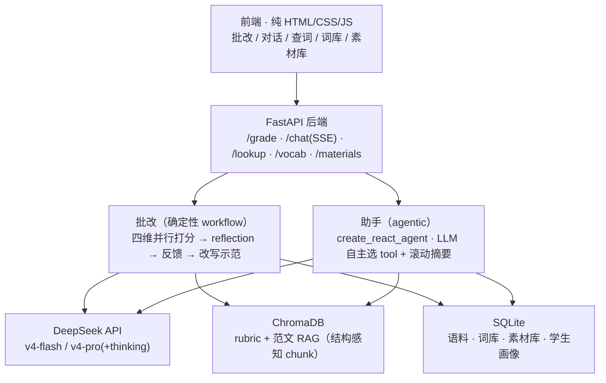

# IELTS Writing Agent

基于 **LangGraph** 的雅思写作（Task 1 + Task 2）批改与学习 Agent，解决备考最大痛点——**反馈稀缺**。它按官方四维（TA / CC / LR / GRA）**逐维打分并给依据**，用已知分数的范文**锚定校准**，并在**考官标注的测试集上量化验证打分质量**。批改是确定性 workflow；助手模式用 function calling 自主调用词汇升级、范文拆解、语法检查等工具，配套跨会话记忆与私有词库/素材库。

> **核心卖点**：在剑桥考官标注的 holdout 测试集（**n=51、`temperature=0` 可复现**）上量化验证打分质量——范文 in-context 锚定经**消融实验**证实把 QWK 从 0.532 提升到 0.597（+0.065）。评测纪律严谨（gold-only ground truth、零泄漏、silver 不作基准）。它是一个**能被量化检验**的批改 Agent，而非自说自话的"打分器"。

| gold holdout, n=51, temp=0 | MAE | ±0.5 | QWK |
|---|---|---|---|
| baseline（无锚定） | 0.667 | 64.7% | 0.532 |
| **anchored（范文锚定）** | **0.637** | 58.8% | **0.597** |

完整评测方法、消融取舍、并行化质量回归、已知局限 → **[docs/EVALUATION.md](docs/EVALUATION.md)**

## 架构

两模式**共用底层**模型与存储；批改是确定性 workflow，助手是 agentic loop。



三个可深讲的技术点：**结构感知 RAG**（rubric 按 `(criterion, band)` 切 + metadata 过滤检索）、**跨会话记忆**（episodic + semantic 学生画像）、**量化评测**（gold-only、锚定消融、QWK）。**打分路径物理隔离**：个性化/记忆在外层图、判分在内层图，学生画像物理上进不了判分逻辑，反馈个性化绝不改分——评测走的正是这条内层管道。

## 快速开始

**前置**：Python 3.13、[Ollama](https://ollama.com)（本地 embedding）、一个 DeepSeek API key。

```powershell
python -m venv .venv; .\.venv\Scripts\Activate.ps1
pip install -r requirements.txt          # 版本已固定；完整锁见 requirements.lock
ollama pull bge-m3                        # 本地 embedding（DeepSeek 不提供）
copy .env.example .env                    # 编辑填 DEEPSEEK_API_KEY=...（key 只在后端）
python scripts/build_stage0.py            # 入 SQLite + 灌 ChromaDB（本地 embedding，不调 DeepSeek）
python -m uvicorn src.api.app:app --port 8000   # 浏览器开 http://127.0.0.1:8000
```

`http://127.0.0.1:8000/docs` 有 Swagger 逐端点手测。可选：`pytest tests/`（LLM-free 部分无需 key）、`python scripts/obs_summary.py`（成本/延迟汇总）、`python -m src.eval.harness --config all`（复现评测）。

**技术栈**：LangGraph · DeepSeek API（`v4-flash`/`v4-pro`，OpenAI 兼容）· 本地 bge-m3（Ollama）· ChromaDB · SQLite · FastAPI（SSE 流式）· 纯 HTML/CSS/JS。锁定决策见 [CLAUDE.md](CLAUDE.md)，深度设计见 [DESIGN.md](DESIGN.md)。

## 复现边界与已知局限（如实说明）

- **代码与依赖可完整复现**：干净 venv 按固定版本 `requirements.txt` 安装、核心导入与 LLM-free 测试全通过。
- **数据**：评测用的 gold 集（考官标注范文正文 + 标签）已随仓库提供（`data/gold/`）；但 `data/raw/`（剑桥真题 PDF + silver CSV，约 72MB）因**版权与体积未纳入仓库**，故 `build_stage0.py` 需自备源文件才能重建完整检索库。无源数据时代码/设计/评测数字仍可审阅。
- **评测局限**：四维小分无 gold 标注（只有 overall 有 ground truth）、n=51 置信区间较宽、单用户 demo 无鉴权（不宜公网直接暴露）。详见 [docs/EVALUATION.md](docs/EVALUATION.md)。

**明确不做**：口语 / 听力 / 阅读、多智能体架构、模型微调、用户系统 / 鉴权、移动端原生 App。
