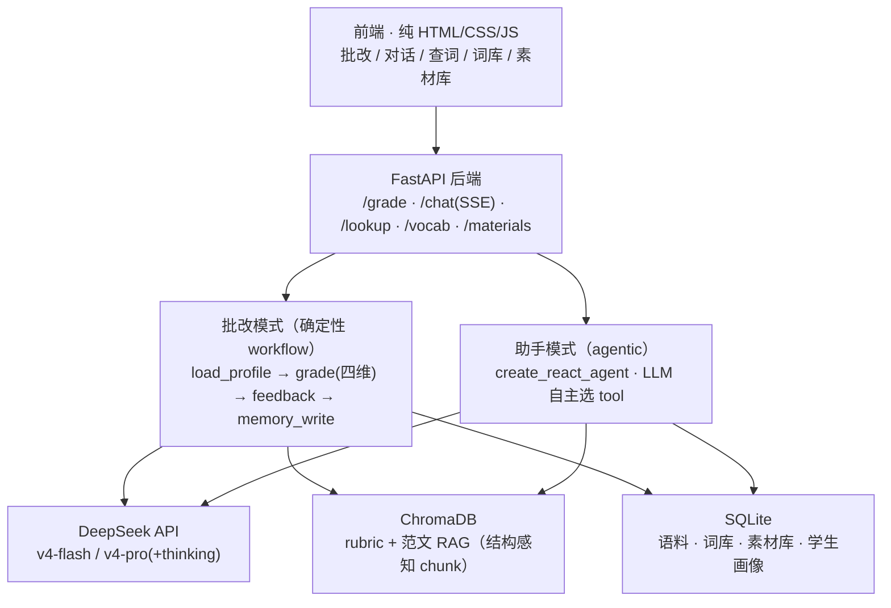

# IELTS Writing Agent

一个基于 **LangGraph** 的雅思写作（Task 1 + Task 2）批改与学习 Agent。它解决雅思备考最大的痛点——**反馈稀缺**：考生写完作文，拿不到按官方标准拆解的、可执行的反馈。市面工具多是"打个总分 + 一段套话"，既不透明也不可信。

本项目做得更接近真人写作教练：按官方四维（TA / CC / LR / GRA）**逐维打分并给依据**，用已知分数的范文**锚定校准**，并在**考官标注的测试集上量化验证打分质量**（而非自说自话）。批改是确定性 workflow；助手模式则用 function calling 自主调用词汇升级、范文拆解、语法检查等工具，配套跨会话记忆逐步个性化。

> **一句话卖点**：在剑桥考官标注的 holdout 测试集（n=51、`temperature=0` 可复现）上**量化验证**打分质量，并通过范文 in-context 锚定 + **消融实验**证实校准提升——评测纪律严谨、零泄漏、silver 不作基准。它是一个**能被量化检验**的批改 Agent，而非自说自话的"打分器"。

---

## 核心能力

- **批改模式（确定性 workflow）**：提交作文 → 四维每次必跑 → 每维给 band + 依据 → 聚合 overall → 教练式反馈 + 改写建议。四维不让 LLM 自己决定跳过。
- **助手模式（agentic）**：对话式，LLM 通过 function calling 自主选工具——词汇升级（带误用陷阱提醒）、范文生成、文章拆解、语法检查、查词、打分、一键归档。
- **私有词库 / 素材库**：查词或对话产出可一键存入，落 SQLite，跨会话保留。
- **跨会话记忆**：短期（session 内多轮）+ 长期（学生画像：反复错误、薄弱维度、band 走势），反馈随画像个性化。
- **量化评测 + 可观测性**：gold 集上算 MAE / ±0.5 / QWK；每次 LLM 调用记录档位 / token / 延迟 / 成本。

---

## 架构

两种模式**共用底层**模型与存储；批改是确定性 workflow，助手是 agentic loop。



**打分路径物理隔离**：批改外层图负责读/写画像和个性化反馈**措辞**，但 `grade` 节点只把 essay/task/prompt 喂进内层纯打分图——**学生画像物理上进不了判分逻辑**，反馈个性化绝不改分。评测走的正是这条内层打分管道。

---

## Evaluation

这是本项目的核心差异化资产。**评测纪律**决定数字可信：

- **Ground truth 只用 gold tier**：剑桥真题官方考官标注，`WHERE tier='gold' AND split='holdout'`，**n=51**。
- **零泄漏**：范文锚点全部来自 `split='exemplar'`，跑前硬断言与 holdout 零重叠（防 few-shot 泄漏）。
- **silver**（网络数据集，噪声大）只作辅助，**不作基准**。
- 所有打分 **`temperature=0`**，可复现。

| 配置（gold holdout, n=51, temp=0） | MAE | ±0.5 | ±1.0 | **QWK** |
|---|---|---|---|---|
| baseline（flash，无锚定） | 0.667 | 64.7% | 86.3% | 0.532 |
| **anchored（flash + 范文 in-context 锚定）** | **0.637** | 58.8% | 86.3% | **0.597** |
| anchored + reflection（pro+thinking 回环） | 0.686 | 62.7% | 86.3% | 0.554 |

**锚定消融结论**：范文 in-context 锚定把 **QWK 0.532 → 0.597（+0.065）**、MAE 0.667 → 0.637——给模型"已知 band 的校准梯子"，压掉大偏差、改善序数一致性。

**诚实的取舍**：

- **reflection 回环在本测试集上无增益**（QWK 反降、MAE 略升），故从默认管道移除（代码保留）。默认打分管道 = 锚定开 / reflection 关。
- **方法论提醒**：钉 `temperature=0` 之前，锚定"看似 +0.23 QWK"的大涨其实主要是采样方差；钉死随机性后如实测得 **+0.065**。可复现的数字才算数。

> **为什么看 QWK**：band 是序数量，QWK（Quadratic Weighted Kappa）用二次权重惩罚"差得远"的预测并校正随机一致，是自动作文评分（AES）文献的标准指标；纯准确率把所有错判等同、看不出偏离幅度。

**记忆没污染打分**：关掉个性化跑同一份 gold holdout，QWK 0.597→0.605、±0.5 0.588→0.667（同代码 temp=0 的 API 抖动内，无向下漂移）——佐证画像只改反馈措辞、进不了判分。

复现：`python -m src.eval.harness --config all`（写 `data/eval/results.jsonl`）；`--compare` 看历史对比。

---

## 关键设计决策

| 决策 | 为什么 |
|---|---|
| **批改是 workflow，不是自主 agent** | 四维每次必跑，不让 LLM 决定跳过——评分要确定、可复现；只有 reflection 回环和助手选 tool 是 agentic 的。 |
| **结构感知 chunking** | rubric 按 `(criterion, band)` 逻辑单元切、挂 metadata，检索先按 criterion+band 窗口过滤再向量召回；范文按整篇切、带 `{task, band, topic, tier}`。比固定大小切分高一档。 |
| **打分用范文 in-context 锚定** | 喂已知 band 的范文当"校准梯子"，不让模型裸打分——消融证明提升 QWK。 |
| **打分路径物理隔离** | 个性化/记忆在外层图，判分在内层图，profile 进不了打分（测试断言锁死）——保证评测数字与产品行为一致。 |
| **成本感知路由** | 简单工具走 `v4-flash`，判分/反思才考虑 `v4-pro`；默认全 flash，有证据才上 pro。 |
| **reflection 试了但移除** | 诚实展示：上了条件回环，消融显示本测试集无增益，果断移除。 |

完整设计见 [`IELTS-Writing-Agent-设计文档.md`](IELTS-Writing-Agent-设计文档.md)，锁定决策见 [`CLAUDE.md`](CLAUDE.md)。

---

## 快速开始

**前置**：Python 3.13、[Ollama](https://ollama.com)（本地 embedding）、一个 DeepSeek API key。

```powershell
# 1. 环境
python -m venv .venv
.\.venv\Scripts\Activate.ps1
pip install -r requirements.txt

# 2. 本地 embedding 模型（DeepSeek 不提供 embedding）
ollama pull bge-m3

# 3. 配置密钥（key 只在后端 .env，绝不进代码/前端）
copy .env.example .env
#   编辑 .env 填 DEEPSEEK_API_KEY=...

# 4. 构建数据地基（入 SQLite + 灌 ChromaDB；本地 embedding，不调 DeepSeek）
python scripts/build_stage0.py

# 5. 起 web app（后端同源提供前端，无需单独起前端）
python -m uvicorn src.api.app:app --port 8000
#   浏览器开 http://127.0.0.1:8000
#   http://127.0.0.1:8000/docs 有 Swagger 逐端点手测
```

**可选**：`pytest tests/ -v`（LLM-free 部分无需 key）；`python scripts/obs_summary.py` 看调用成本 / 延迟汇总。

> **数据与可复现范围（如实说明）**：**代码与依赖可完整复现**——干净 venv 按固定版本 `requirements.txt` 安装、核心导入与 LLM-free 测试全通过（20 passed）。评测用的 **gold 集**（考官标注的范文正文 + 标签）已随仓库提供（`data/gold/`），评测逻辑可读、gold 标签可查。但 `data/raw/`（剑桥真题 PDF + silver 语料 CSV，约 72MB）因**版权与体积未纳入仓库**；因此第 4 步 `build_stage0.py` 需要你自备这些源文件才能重建完整语料库与 ChromaDB 检索库。没有它们时无法端到端起服务（批改要检索 rubric），但代码、设计、评测数字均可审阅。

---

## 技术栈

**编排** LangGraph（StateGraph + 子图 + 条件边 + checkpointer） · **LLM** DeepSeek API（`v4-flash` / `v4-pro`，OpenAI 兼容） · **Embedding** 本地 bge-m3（Ollama） · **向量库** ChromaDB · **存储** SQLite · **后端** FastAPI（SSE 流式） · **前端** 纯 HTML/CSS/JS

## 项目结构

```
src/
├── config.py        模型名 / 成本路由 / 定价常量
├── llm.py           DeepSeek 封装 + 成本路由 + 可观测 callback
├── data/            异构数据归一化、入库
├── rag/             结构感知 chunk / embed / ChromaDB 检索
├── graph/           批改图：state / nodes / 内层打分图 / 外层会话图
├── agent/           助手模式：create_react_agent 对话图
├── tools/           7 个写作工具（约束 JSON 输出）
├── memory/          短期 checkpointer + 长期学生画像
├── eval/            评测 harness（MAE / ±0.5 / QWK / 锚定消融）
├── obs/             可观测性：LLM 用量 / 延迟 / 成本追踪
├── db/              SQLite schema + 词库/素材库 CRUD
└── api/             FastAPI（包住图/工具，SSE 流式）
frontend/            纯 HTML/CSS/JS 五视图
tests/               分阶段测试（LLM-free + RUN_LLM_TESTS gated）
```

## 项目状态

阶段 0–6 全部完成（数据地基 → 四维打分 → eval harness → 工具/助手 → 记忆 → 前端 → 可观测性/文档）。**v1 完成**。

**明确不做**：口语 / 听力 / 阅读、多智能体架构、模型微调、用户系统 / 鉴权、移动端原生 App。
